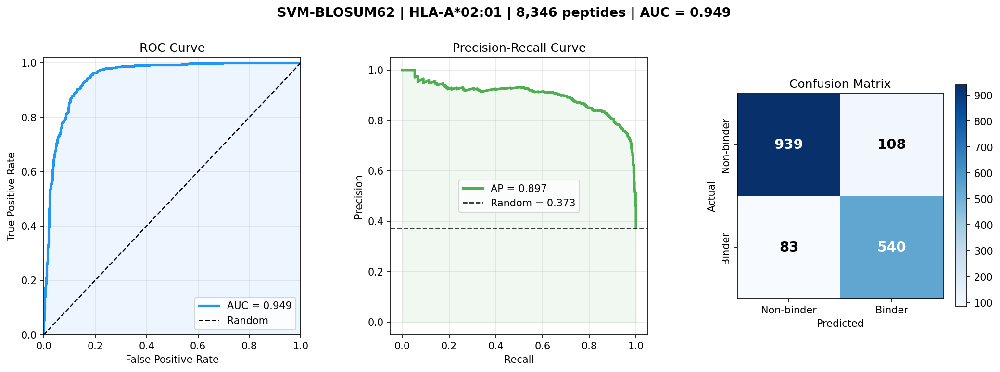
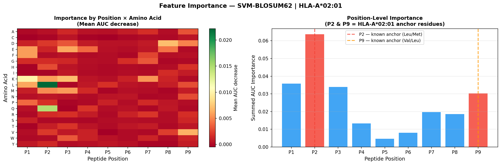
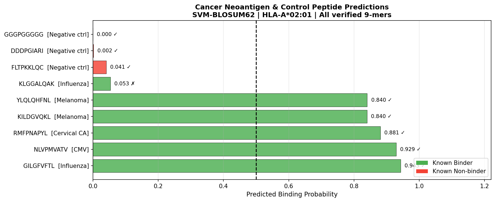

# MHC-I Peptide Binding Predictor

Supervised ML model predicting neoantigen binding to HLA-A*02:01  
for cancer immunotherapy applications.

## Results

| Model | ROC-AUC | Accuracy | Avg Precision |
|-------|---------|----------|---------------|
| SVM-BLOSUM62 (this work) | **0.949** | 88.6% | 0.897 |
| Random baseline | 0.500 | 62.7% | 0.373 |

## Evaluation Dashboard


## Feature Importance


## Neoantigen Panel


## Dataset
- Source: IEDB (Immune Epitope Database)
- Allele: HLA-A*02:01, 9-mers only
- 8,346 unique peptides after deduplication
- 37.3% binders (IC50 < 500 nM), 62.7% non-binders

## Method
1. Raw IEDB export → filter nM IC50 assays → 9-mer extraction
2. BLOSUM62 encoding (180-dim per peptide)
3. SVM with RBF kernel (C=10, γ=0.001), class-balanced
4. 5-fold stratified CV → AUC 0.934 ± 0.009

## Key Biological Finding
Feature importance (permutation, AUC decrease) confirmed the model  
learned real MHC-I biology without supervision:
- **P2** = highest importance → matches known Leu/Met anchor preference
- **P9** = elevated importance → matches known Val/Leu C-terminal anchor
- Negative controls (poly-G, D-rich peptides) scored < 0.005

## Neoantigen Validation (8/9 correct, 89%)
| Peptide | Source | Probability | Result |
|---------|--------|-------------|--------|
| GILGFVFTL | Influenza M1 | 0.943 | ✓ Binder |
| NLVPMVATV | CMV pp65 | 0.929 | ✓ Binder |
| RMFPNAPYL | HPV Cervical CA | 0.881 | ✓ Binder |
| KILDGVQKL | Melanoma BRAF V600E | 0.840 | ✓ Binder |
| YLQLQHFNL | Melanoma NRAS Q61R | 0.840 | ✓ Binder |
| FLTPKKLQC | Negative control | 0.041 | ✓ Non-binder |
| DDDPGIARI | Negative control | 0.002 | ✓ Non-binder |
| GGGPGGGGG | Negative control | 0.000 | ✓ Non-binder |
| KLGGALQAK | Influenza M1 (weak) | 0.053 | ✗ (IC50 ~2000nM, above threshold) |

## Stack
- Python 3.11 · scikit-learn · BioPython · pandas · numpy · matplotlib
- Dataset: [IEDB](https://www.iedb.org/)

## Quick Start
```bash
pip install pandas numpy scikit-learn biopython matplotlib seaborn
jupyter notebook notebooks/mhc_binding_predictor.ipynb
```
